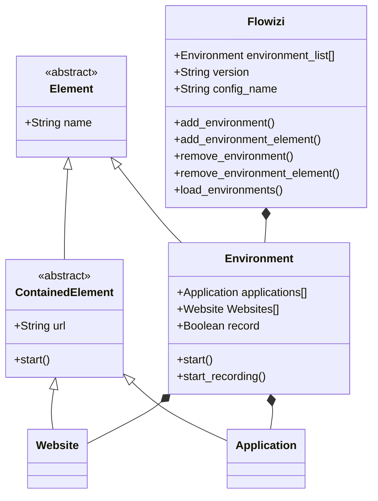

# Arquitecture

#### Class hierarchy in Flowizi

```mermaid
classDiagram
    class Element{
        <<abstract>>
        +String name 
    }
    class ContainedElement{
        <<abstract>>
        +String url
        +start()
    }
    class Environment{
        +Application applications[]
        +Website Websites[]
        +Boolean record
        +start()
        +start_recording()
    }
    class Flowizi{
        +Environment environment_list[]
        +String version
        +String config_name
        +add_environment()
        +add_environment_element()
        +remove_environment()
        +remove_environment_element()
        +load_environments()
    }
    Element <|-- ContainedElement
    Element <|-- Environment
    ContainedElement <|-- Website
    ContainedElement <|-- Application
    Environment *-- Application
    Environment *-- Website
    Flowizi *-- Environment
```
